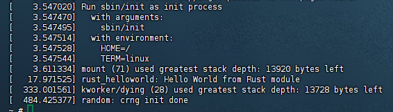

## 使用rust编写一个简单的内核模块并运行

### 1. 添加rust_helloworld.rs文件
在Linux目录下samples/rust文件夹中添加一个rust_helloworld.rs文件  
文件内容为：
```rust
// SPDX-License-Identifier: GPL-2.0
//! Rust minimal sample.
      
use kernel::prelude::*;
      
module! {
  type: RustHelloWorld,
  name: "rust_helloworld",
  author: "whocare",
  description: "hello world module in rust",
  license: "GPL",
}
      
struct RustHelloWorld {}
      
impl kernel::Module for RustHelloWorld {
  fn init(_name: &'static CStr, _module: &'static ThisModule) -> Result<Self> {
      pr_info!("Hello World from Rust module");
      Ok(RustHelloWorld {})
  }
}
```

### 2. 修改Kconfig和Makefile
在samples/rust文件夹下的Kconfig文件中添加：
```
config SAMPLE_RUST_HELLOWORLD
	tristate "Print Helloworld in Rust"
	help
	  This option builds the print hello world use case for Rust.

	  If unsure, say N.
```
在samples/rust文件夹下的Makefile文件中添加：
```
obj-$(CONFIG_SAMPLE_RUST_HELLOWORLD)		+= rust_helloworld.o
```

### 3. 配置helloworld模块
```shell
make LLVM=1 menuconfig
```
路径：Kernel hacking > Sample Kernel code > Rust samples > &lt;M&gt;Print Helloworld in Rust (NEW)


### 4. 运行build_image.sh脚本
将在samples/rust下的rust_helloworld.ko的文件复制到src_e1000/rootfs目录下，
然后跑build_image.sh
```shell
cp ./linux/samples/rust/rust_helloworld.ko ../src_e1000/rootfs
cd ../src_e1000
./build_image.sh
```
### 5. 加载helloworld模块
```shell
insmod rust_helloworld.ko
dmesg
```
- insmod：加载模块  
- dmesg：查看内核日志  
  