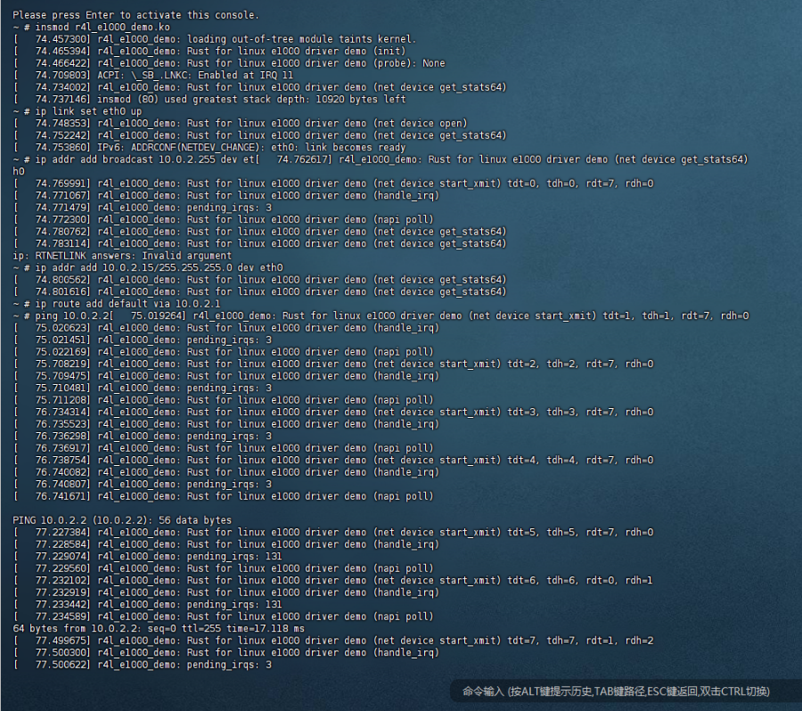
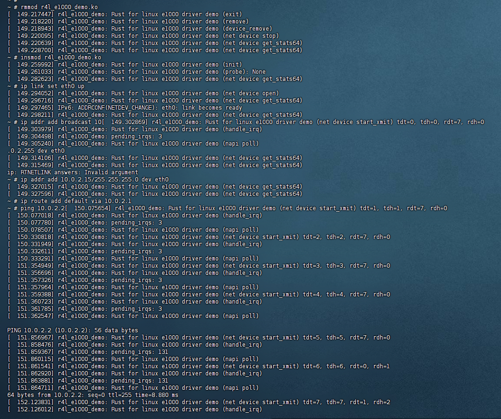

## 为e1000网卡驱动添加remove代码

### 1. 添加get_net_device_ptr()函数
添加get_net_device_ptr()函数到linux/rust/kernel/net.rs里的***impl Device{}***中
```rust
    // 获取 net_device 指针
    pub unsafe fn get_net_device_ptr(&self) -> *mut bindings::net_device {
        self.0.get()
    }
```

### 2. 为驱动程序私有数据结构添加新字段
在r4l_e1000_demo中修改以下代码：
```rust
struct NetDevicePrvData {
    ...
    pci_dev: Arc<*mut bindings::pci_dev>, // pci_dev指针
}
```

```rust
unsafe {
            let pci_dev = dev.get_pci_device_ptr();

            // 注册网络设备及其私有数据
            netdev_reg.register(Box::try_new(
                NetDevicePrvData {
                    ...
                    pci_dev: Arc::try_new(pci_dev)?,
                }
            )?)?;

            // 返回驱动程序私有数据
            Ok(Box::try_new(
                    E1000DrvPrvData {
                        // 必须持有这个注册，否则设备将被移除
                        _netdev_reg: netdev_reg,
                    }
                )?)
    }
```

### 3. 实现remove函数
```rust
// 设备移除函数
fn remove(data: &Self::Data) {
    pr_info!("Rust for linux e1000 driver demo (remove)\n");

    // 获取私有数据
    let edpd = data.as_ref(); // 驱动程序私有数据
    let dev = &*(edpd._netdev_reg.dev_get());  // 转换为 &Device
    let dev_ptr = unsafe{ dev.get_net_device_ptr()};  // 获取 net_device 指针
    let drvdata = unsafe { &*(bindings::dev_get_drvdata(&mut (*dev_ptr).dev) as *const NetDevicePrvData) }; // 获取 Box<NetDevicePrvData>
    let pci_dev = unsafe { drvdata.pci_dev.as_ref() };  // 获取 pci_dev: *mut bindings::pci_dev

    // 注销中断处理程序
    let irq_handler_ptr = drvdata._irq_handler.load(core::sync::atomic::Ordering::Relaxed);
    if !irq_handler_ptr.is_null() {
        unsafe { Box::from_raw(irq_handler_ptr) };
    }

    // 释放 PCI 设备资源
    let bars = unsafe { bindings::pci_select_bars(*pci_dev, (bindings::IORESOURCE_MEM | bindings::IORESOURCE_IO) as u64) } as i32;
    unsafe { bindings::pci_release_selected_regions(*pci_dev, bars) };
}
```
### 4. 运行结果
```shell
insmod r4l_e1000_demo.ko
ip link set eth0 up
ip addr add broadcast 10.0.2.255 dev eth0
ip addr add 10.0.2.15/255.255.255.0 dev eth0
ip route add default via 10.0.2.1
ping 10.0.2.2
````


```shell
rmmod r4l_e1000_demo.ko
insmod r4l_e1000_demo.ko
ip link set eth0 up
ip addr add broadcast 10.0.2.255 dev eth0
ip addr add 10.0.2.15/255.255.255.0 dev eth0
ip route add default via 10.0.2.1
ping 10.0.2.2
```
