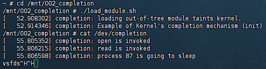
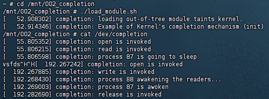
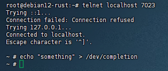

## 项目小试验 

### 1. completion.rs
```rust
// SPDX-License-Identifier: GPL-2.0

//! Rust for linux completion test


use core::result::Result::Err;

use kernel::prelude::*;
use kernel::sync::{Mutex, Arc};
use kernel::{chrdev, file, bindings};
use kernel::task::Task;
use core::sync::atomic::{AtomicPtr, Ordering};
use core::ptr;

module! {
type: Completiondev, // 指定模块类型为Completiondev
name: "completion", // 模块名称为completion
author: "Tester", // 模块作者信息
description: "Example of Kernel's completion mechanism", // 模块描述信息
license: "GPL", // 模块许可证类型为GPL
}

static COMPLETION_DATA: AtomicPtr<CompletionData> = AtomicPtr::new(ptr::null_mut());
// 定义全局内存缓冲区的大小为4KB
const GLOBALMEM_SIZE: usize = 0x1000;

// 静态全局内存缓冲区，使用互斥锁进行保护。这里使用了unsafe代码块，因为静态变量初始化的要求。
// 互斥锁保护的全局缓冲区用于在字符设备操作中存储数据。
static GLOBALMEM_BUF: Mutex<[u8; GLOBALMEM_SIZE]> = unsafe {
    Mutex::new([0u8; GLOBALMEM_SIZE])  // 初始化全局缓冲区为全零
};

struct CompletionData {
    com: bindings::completion,
}
unsafe impl Send for CompletionData {}
unsafe impl Sync for CompletionData {}

impl CompletionData {
    fn try_new() -> Result<Arc<Self>> {
        let data = Arc::try_new(CompletionData {
            com: bindings::completion::default(),
        })?;
        unsafe {
            bindings::init_completion(&data.com as *const _ as *mut _);
        }
        Ok(data)
    }

    fn set_completion_data(data: Arc<CompletionData>) {
        let raw_ptr = Arc::into_raw(data) as *mut CompletionData;
        COMPLETION_DATA.store(raw_ptr, Ordering::Release);
    }

    fn get_completion_data() -> Option<Arc<CompletionData>> {
        let raw_ptr = COMPLETION_DATA.load(Ordering::Acquire);
        if raw_ptr.is_null() {
            None
        } else {
            // 从原始指针创建 Arc，增加引用计数后将原指针放回
            let arc = unsafe { Arc::from_raw(raw_ptr as *mut CompletionData) };
            let cloned_arc = Arc::clone(&arc);
            // 将原始指针重新转换回原始指针以避免破坏引用计数
            Arc::into_raw(arc);
            Some(cloned_arc)
        }
    }
}

// 定义表示文件的结构体
struct RustFile {
    #[allow(dead_code)]
    inner: &'static Mutex<[u8; GLOBALMEM_SIZE]>, // 引用全局内存缓冲区
}

// 为RustFile实现文件操作的trait
#[vtable]
impl file::Operations for RustFile {
    type Data = Box<Self>; // 文件操作的数据类型定义为Box包装的RustFile

    // 打开文件时的操作，返回一个包含RustFile实例的Box
    fn open(_shared: &(), _file: &file::File) -> Result<Box<Self>> {
        pr_info!("open is invoked\n");
        Ok(
            Box::try_new(RustFile {
                inner: &GLOBALMEM_BUF,
            })?) // 创建一个新的RustFile实例并返回
    }

    fn write(_this: &Self, _file: &file::File, _reader: &mut impl kernel::io_buffer::IoBufferReader, _offset: u64) -> Result<usize> {
        pr_info!("write is invoked\n");

        let task = Task::current();
        pr_info!(
             "process {} awakening the readers...\n",
                task.pid()
        );

        if let Some(completion_data) = CompletionData::get_completion_data() {
            unsafe {
                bindings::complete(&completion_data.com as *const _ as *mut _);
            }
        }

        let mut guard = _this.inner.lock(); // 锁定全局内存缓冲区
        let buffer = &mut *guard;

        // 检查偏移量是否超出缓冲区大小
        if _offset as usize >= GLOBALMEM_SIZE {
            return Err(EINVAL); // 返回无效参数错误
        }

        // 计算剩余空间
        let remaining_space = GLOBALMEM_SIZE - _offset as usize;
        // 计算实际要写入的数据大小，不能超过reader中的数据长度和剩余空间
        let data_to_write = core::cmp::min(_reader.len(), remaining_space);

        // 将数据从reader读取到全局内存缓冲区中
        unsafe {
            _reader.read_raw(buffer.as_mut_ptr().add(_offset as usize), data_to_write)?;
        }

        Ok(data_to_write) // 返回实际写入的数据大小
    }

    fn read(_this: &Self, _file: &file::File, _writer: &mut impl kernel::io_buffer::IoBufferWriter, _offset: u64) -> Result<usize> {
        pr_info!("read is invoked\n");

        let task = Task::current();
        pr_info!(
            "process {} is going to sleep\n",
            task.pid()
        );

        if let Some(completion_data) = CompletionData::get_completion_data() {
            unsafe {
                bindings::wait_for_completion(&completion_data.com as *const _ as *mut _);
            }
        }

        let guard = _this.inner.lock(); // 锁定全局内存缓冲区
        let buffer = &*guard;

        // 检查偏移量是否超出缓冲区大小
        if _offset as usize >= GLOBALMEM_SIZE {
            return Ok(0); // 超出缓冲区大小，返回EOF
        }

        // 计算剩余数据量
        let remaining_data = GLOBALMEM_SIZE - _offset as usize;
        // 计算实际要读取的数据大小，不能超过writer中的可写入长度和剩余数据量
        let data_to_read = core::cmp::min(_writer.len(), remaining_data);

        // 将数据从全局内存缓冲区读取到writer中
        unsafe {
            _writer.write_raw(buffer.as_ptr().add(_offset as usize), data_to_read)?;
        }

        pr_info!(
            "process {} is awoken\n",
            task.pid()
        );

        Ok(data_to_read) // 返回实际读取的数据大小
    }

    fn release(_data: Self::Data, _file: &file::File) {
        pr_info!("release is invoked\n");
    }
}

// 定义表示字符设备的结构体
struct Completiondev {
    _dev: Pin<Box<chrdev::Registration<2>>>, // 包含字符设备注册的引用，这里注册了两个次设备
}

// 为Completiondev实现内核模块的trait
impl kernel::Module for Completiondev {
    fn init(name: &'static CStr, module: &'static ThisModule) -> Result<Self> {
        pr_info!("Example of Kernel's completion mechanism (init)\n"); // 模块初始化时打印信息

        // 创建一个新的字符设备注册，指定设备名称和模块引用
        let mut chrdev_reg = chrdev::Registration::new_pinned(name, 0, module)?;

        // 注册同一种设备两次，以演示可以使用多个次设备。这里次设备类型为chrdev::Registration<2>。
        chrdev_reg.as_mut().register::<RustFile>()?; // 注册第一个次设备
        chrdev_reg.as_mut().register::<RustFile>()?; // 注册第二个次设备

        let completion_data = CompletionData::try_new()?;
        CompletionData::set_completion_data(completion_data);

        // 返回包含字符设备注册的Completiondev实例
        Ok(Completiondev {
            _dev: chrdev_reg ,
        })
    }
}

// 为Completiondev实现析构函数，模块卸载时调用
impl Drop for Completiondev {
    fn drop(&mut self) {
        pr_info!("Example of Kernel's completion mechanism (exit)\n"); // 模块卸载时打印信息
    }
}

```

### 2. Makefile
```
ifneq ($(KERNELRELEASE),)

# In kbuild context
module-objs := completion.o
obj-m := completion.o

CFLAGS_completion.o := -DDEBUG
else
KDIR := ../../../linux
PWD := $(shell pwd)

all:
	$(MAKE) LLVM=1 -C $(KDIR)  M=$(PWD) modules

.PHONY: clean
clean:
	rm -f *.ko *.o .*.cmd .*.o.d *.mod *.mod.o *.mod.c *.symvers *.markers *.unsigned *.order *~
endif
```

### 3. 运行结果
***console 1***
```shell
./boot.sh
cd /mnt/002_completion
./load_module.sh
cat /dev/completion
```
  

**在console 2运行`echo "something" > /dev/completion`命令后，console 1变为：**



***console 2***
```shell
telnet localhost 7023
echo "something" > /dev/completion
```
